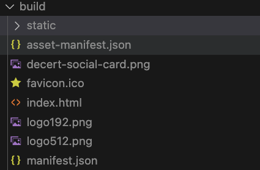
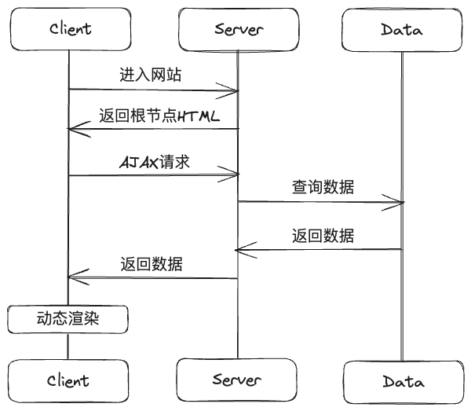
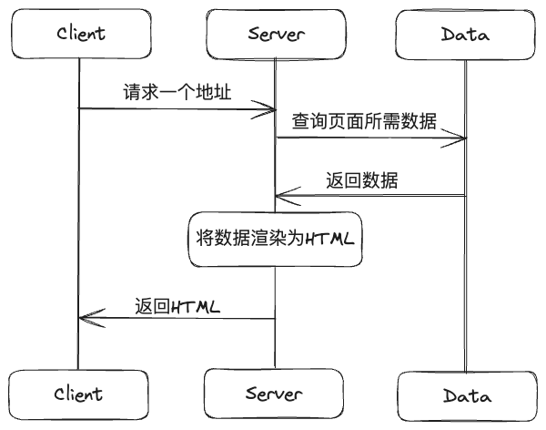
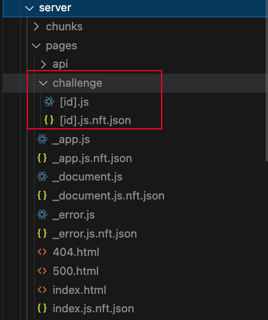

# Next.js_v14 概览

- React web生态
  - 常见框架
  - 优劣对比
  - 总结
- Next简介
  - Next渲染模式
  - Next代码规范

## React Web 生态

### 常见框架

#### Ceate React App

​	Create React App 是一个用于快速搭建 React 应用程序的脚手架工具。它使用了单页应用（Single-Page Application）的渲染模式。在单页应用中，所有的页面内容都是通过 JavaScript 动态生成的，而不是每次请求都返回一个完整的 HTML 页面。

当你使用 Create React App 构建应用程序时，它会生成一个静态文件的构建版本。这个构建版本包含了所有的 JavaScript、CSS 和其他静态资源文件。这些文件可以通过一个 web 服务器（如 Nginx）来提供给用户。

通过 Nginx 代理静态文件时，它会将所有的请求都指向构建版本中的 index.html 文件。这样，当用户访问应用程序的任何路由时，Nginx 会将请求转发给 index.html 文件，然后由 React Router 来处理路由匹配和页面渲染。

#### Gatsby

​	Gatsby是一个静态站点生成器，它使用React来构建快速、安全和可扩展的静态网站。它具有丰富的插件生态系统和优化功能，可以帮助开发者构建出色的网站和博客。它默认采用静态站点生成（SSG）的渲染模式。这意味着在构建过程中，Gatsby会预先生成整个网站的静态HTML、CSS和JavaScript文件，然后将这些静态文件部署到内容交付网络（CDN）上，以便用户在访问时能够快速加载网站内容。

这种渲染模式适合内容不经常变化的网站，能够提供快速的用户体验和高级别的安全性。除了静态站点生成，Gatsby还支持延迟静态生成（DSG）和服务器端渲染（SSR）等渲染模式，使开发者能够根据需求选择最适合的渲染方式。

#### Next.js

​	Next.js是一个基于React的全栈框架，它提供了服务器端渲染（SSR）和静态网站生成（SSG）等功能。它还具有路由管理、数据获取和代码分割等特性，使得构建高性能的React应用变得更加简单。

Next.js提供了两种主要的渲染方式：服务器端渲染（SSR）和静态站点生成（SSG）。

服务器端渲染（SSR）是指在每次请求页面时，服务器会动态地生成页面的HTML内容，并将其发送给客户端。这种方式可以使页面在加载时就具备完整的内容，有利于搜索引擎优化和首次加载速度。服务器端渲染适用于需要根据每个请求动态生成内容的场景，例如个性化页面或需要实时数据的应用。

静态站点生成（SSG）是指在构建时就生成页面的HTML内容，并将其存储在内容分发网络（CDN）上。当用户请求页面时，CDN会直接返回预生成的HTML文件，无需再次构建和渲染页面。这种方式可以提供更快的加载速度和更好的性能，适用于内容相对稳定、不需要频繁更新的场景，例如博客、产品列表等。

在Next.js中，你可以根据具体需求选择使用服务器端渲染还是静态站点生成。你可以根据页面的特点和需求来决定使用哪种渲染方式，或者在不同页面中结合使用两种方式。

总结来说，服务器端渲染适用于需要动态生成内容的场景，而静态站点生成适用于内容相对稳定、不需要频繁更新的场景。Next.js提供了灵活的渲染方式，可以根据项目的具体需求选择最合适的渲染方式。

------

### 优劣对比

**TODO =======**

------

### 总结

#### Create React App

​	客户端渲染（Client-Side Rendering），因为页面的渲染是在用户的浏览器中完成的。

**缺点:**

 - 首屏渲染慢
   - 因为页面没有内容，必须等到js加载完成并执行才能呈现内容
 - 不利于SEO
   - 因为页面没有内容，搜索引擎爬虫爬取不到关键词信息进行索引
 - 性能优化方面较少

**优点:**

	- 对配置要求不高，提供了预配置的工具链
	- 适合初学者
