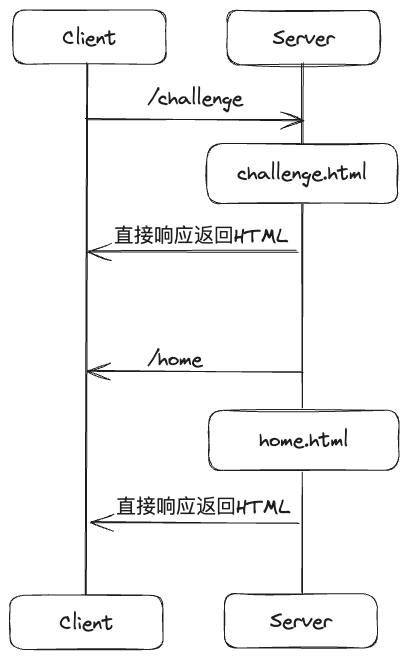
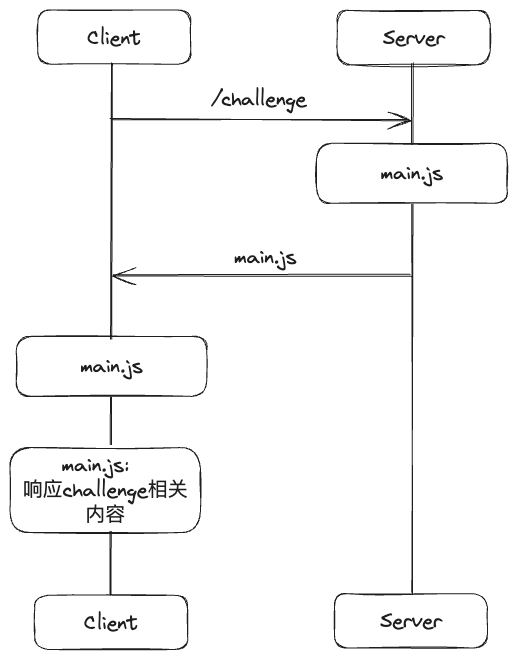
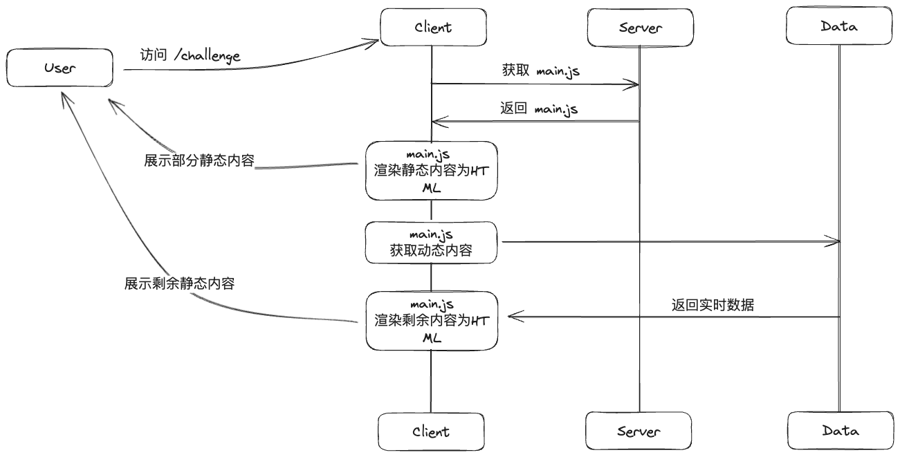
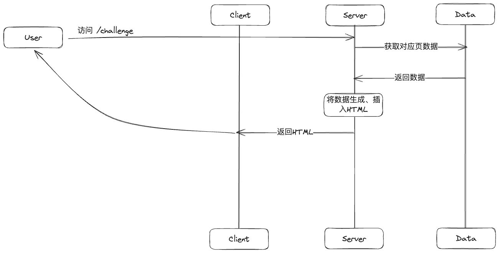
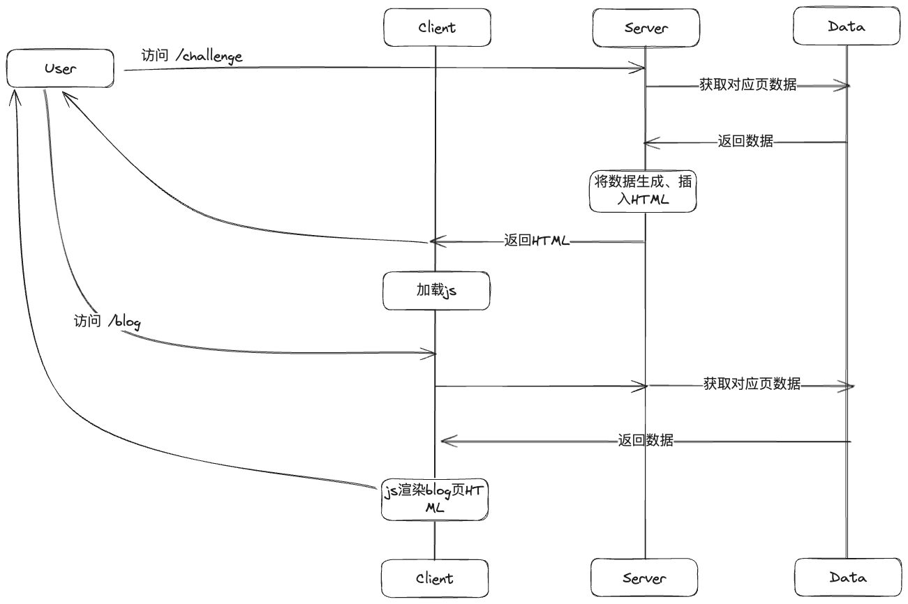
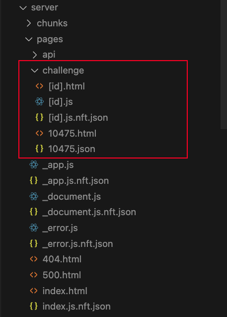

# 前端常见渲染模式概览

​		在前端开发中，"渲染"是一个核心概念。它涉及到如何将数据（通常来自服务器）和模板（HTML、CSS、JavaScript等）结合起来，生成用户可以看到和交互的网页。

这个过程可以在服务器端完成，也可以在客户端（浏览器）完成，或者在构建阶段就完成。这就涉及到了不同的渲染模式。

## Web应用常见架构模式

#### MPA:

MPA（`multiple page application`） 称为**多页应用**，在MPA模式下，每个页面都是独立的，页面之间的交互需要通过服务器进行。当用户执行一个动作（如点击链接）时，浏览器会向服务器发送一个请求，服务器处理请求后返回一个新的HTML页面，浏览器再将这个页面渲染出来。

- **首屏速度快**：各个页面相互独立，需要单独维护多个 html 页面，每个请求都直接返回 html。
- **切换页面比较慢**：基于原生浏览器的文档跳转（`navigating across documents`）。因此每一次的页面更新都是一次页面重载，这将带来巨大的重启性能消耗。
- **对 SEO 友好**：页面在初始时，就具有全部的页面内容而非 「无状态」，从而达到更好的收录效果。

#### SPA:

SPA（`single page application`）称为**单页应用**，在SPA模式下，当用户执行一个动作（如点击链接）时，JavaScript会在浏览器中处理这个动作，可能会向服务器请求数据，然后动态更新页面的部分内容，而不是加载一个新的页面。这种方式可以提供更流畅的用户体验，因为不需要每次都从服务器加载新的页面。

- **页面切换速度快**：路由跳转是基于特定的实现（如 vue-router，react-router 等前端路由），而非原生浏览器的文档跳转，避免了不必要的整个页面重载。
- **前后端分离**：基于前端路由，SPA 与应用后端解耦，使得前端不再依赖于后端的路由分配。
- **首屏时间慢**：首屏除了 html 还要额外请求并执行 js 文件，通过 js 在空页面上渲染首屏。
- **SEO 不友好**：内容都是靠 js 渲染生成出来的，但搜索引擎并不识别这部分内容，导致 SEO 效果差

总结: 

MPA是传统的Web应用架构模式。在MPA中，每个页面都是一个单独的HTML文件，用户在不同的页面之间导航时，浏览器会从服务器加载新的HTML文件。这种模式的优点是简单直观，适合SEO（搜索引擎优化），但缺点是用户在页面之间导航时可能会感到卡顿，因为需要从服务器加载新的页面。

 SPA是一种新的Web应用架构模式，它的主要特点是整个应用只有一个HTML页面，所有的交互都在这个页面中完成，不需要从服务器加载新的页面。这种模式的优点是可以提供流畅的用户体验，但缺点是可能对SEO不友好（尽管现代的搜索引擎已经开始支持SPA），并且初次加载可能会比MPA慢，因为需要加载整个应用的JavaScript代码和数据。

## 常见渲染模式

#### CSR（Client Side Rendering）

CSR（Client-Side Rendering）是一种Web页面渲染方式，其主要特点是页面的内容是在浏览器中由JavaScript动态生成的，而不是从服务器加载的。

在CSR中，服务器初次只返回一个基本的HTML框架和JavaScript应用程序。浏览器加载并执行JavaScript应用程序，然后JavaScript应用程序会在浏览器中动态生成页面的内容，并插入到HTML框架中。这个过程可能会涉及到与服务器的额外通信，例如，JavaScript应用程序可能需要从服务器获取数据，然后根据这些数据生成页面的内容。

#### SSR（Server Side Rendering）

##### 广义语境下: 

SSR（Server-Side Rendering）是一种Web页面渲染方式，其主要特点是页面的内容是在服务器上生成的，然后发送到浏览器。

在SSR中，当用户请求一个页面时，服务器会生成该页面的HTML内容，然后将这个HTML内容发送到浏览器。浏览器接收到HTML内容后，就可以直接显示给用户，无需等待JavaScript代码的加载和执行。

SSR的优点主要有两个。首先，因为页面的内容是在服务器上生成的，所以即使浏览器禁用了JavaScript，用户仍然可以看到页面的内容。其次，SSR对SEO（搜索引擎优化）友好，因为搜索引擎可以直接解析和索引服务器生成的HTML内容。

类似SSM(**spring，springmvc，mybatis**)

SSR也有一些缺点。首先，因为页面的内容是在服务器上生成的，所以服务器的负载可能会较高。其次，虽然SSR可以提供更快的首屏加载时间，但是用户在页面上的交互可能会被延迟，因为浏览器还需要加载和执行JavaScript代码来添加交互功能。

##### 现有语境下:

前端SSR渲染一般指的是**首屏服务端渲染**或`**同构渲染（Isomorphic render）**`，即新开页面访问 SSR 应用时，首屏会返回完整的 html(脱水`dehydrate`)，浏览器通过执行js代码(**注水**`hydrate`)成为 React 或 Vue 应用，后续用户进行跳转等操作时不会再向服务端请求 html，而是以类似单页应用的方式进行。

#### SSG（Static Site Generation）

SSG（静态站点生成）与 SSR 的原理非常类似，但不同之处在于 HTML 文件是预先生成的，而不是在服务器实时生成。

工作流程: 

1. **构建阶段**：在构建过程中，SSG 将源文件和模板（如HTML、CSS）结合，生成静态页面。这些页面通常由预定义的布局、组件和样式组成。
2. **预渲染**：SSG 在构建过程中会自动执行预渲染。这意味着 SSG 会根据预定义的路由和数据源，在构建时生成静态页面的多个实例。例如，对于一个博客，每篇文章都可以在构建过程中生成一个独立的静态页面。
3. **静态输出**：一旦构建完成，SSG 将生成的静态页面输出到目标文件夹中。这些页面包含所有必要的 HTML、CSS 和 JavaScript，以及任何相关的静态资源（如图像、视频等）。
4. **部署**：生成的静态页面可以直接部署到任何支持静态文件的Web服务器上。因为这些页面不需要动态生成，所以它们可以被高效地缓存和交付给访问者，提供更好的性能和可扩展性。
5. **用户访问**：首屏直接解析 html 生成 dom。接着和 SSR 一样通过 hydrate 将整个应用转变成为 React 或 Vue 应用，使用户在交互时与单页应用无异。

#### ISR（Incremental Static Regeneration）

ISR（Incremental Static Regeneration）是一种页面渲染策略，它结合了静态页面生成（SSG）和服务器端渲染（SSR）的优点。这种策略是由Next.js引入的。

在ISR模式下，页面在构建时被预渲染为静态文件，就像SSG一样。然而，与SSG不同的是，这些页面可以在后续被"再生成"或"更新"。

具体来说，当用户请求一个页面时，服务器首先会提供当前已经生成的静态版本。然后，服务器会在后台异步地重新生成这个页面。这个新生成的页面会替换掉旧的静态版本，用于响应后续的请求。

