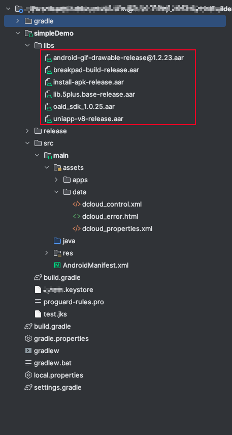
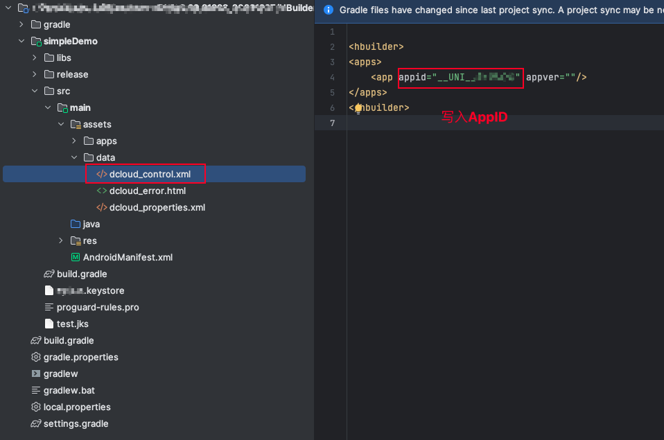
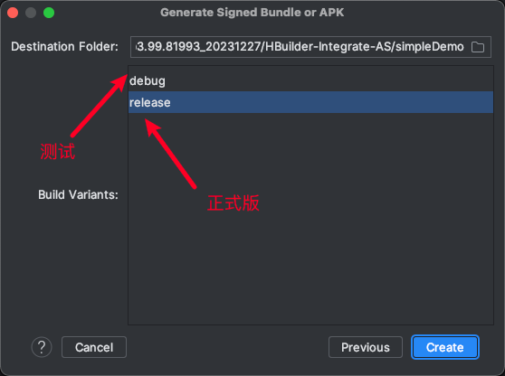

## uni-app离线打包


#### 前置准备

- 下载 [Andriod Studio](https://developer.android.com/studio?hl=zh-cn)

- 下载 [SDK](https://nativesupport.dcloud.net.cn/AppDocs/download/android.html)

- 下载 [JDK11](https://www.azul.com/downloads/#zulu)

- 生成`keystore`

- 生成本地App资源 `__UNI__xxx`

  


#### 初始化Android Studio项目

​	1、 解压 `SDK` 

​	2、 将指定文件拖入 `Android Studio` 中


​	3、 将 `本地App资源` 放入指定目录下并删除该目录下的原文件


​	4、 将 `keystore` 放入指定目录下


​	5、 修改Android Studio设置


​	6、 将`SDK/libs`目录下的以下指定依赖添加至项目中

- android-gif-drawable-release@1.2.23.aar
- breakpad-build-release.aar
- install-apk-release.aar
- lib.5plus.base-release.aar
- oaid_sdk_1.0.25.aar
- uniapp-v8-release.aar


​	


#### 文件配置

##### AndroidManifest.xml


##### dcloud_control.xml




##### strings.xml


##### build.gradle

`com.android.tools.build:gradle:7.3.0`


##### build.gradle


```
apply plugin: 'com.android.application'

android {
    compileSdkVersion 30
    buildToolsVersion '30.0.3'
    lint {
        // Turns off checks for the issue IDs you specify.
        disable 'TypographyFractions','TypographyQuotes'
        // Turns on checks for the issue IDs you specify. These checks are in
        // addition to the default lint checks.
        enable 'RtlHardcoded','RtlCompat', 'RtlEnabled'
        // To enable checks for only a subset of issue IDs and ignore all others,
        // list the issue IDs with the 'check' property instead. This property overrides
        // any issue IDs you enable or disable using the properties above.
        checkOnly 'NewApi', 'InlinedApi'
        // If set to true, turns off analysis progress reporting by lint.
        quiet true
        // If set to true (default), stops the build if errors are found.
        abortOnError false
        // If set to true, lint only reports errors.
        ignoreWarnings true
        // If set to true, lint also checks all dependencies as part of its analysis.
        // Recommended for projects consisting of an app with library dependencies.
        checkDependencies true
    }
    defaultConfig {
        applicationId "appName"	//	写入dcloud平台中应用的 '各平台信息'里 包名的值
        minSdkVersion 21
        targetSdkVersion 30
        versionCode 1		//	写入你uniapp项目中manifest.json中的versionCode值
        versionName "1"		//	写入你uniapp项目中manifest.json中的versionName值
        multiDexEnabled true
        compileOptions {
            sourceCompatibility JavaVersion.VERSION_1_8
            targetCompatibility JavaVersion.VERSION_1_8
        }
    }
    signingConfigs {
        config {
            keyAlias "test"		//	写入你keystore别名，若没有则填原名
            keyPassword '123456'	//	写入你keystore别名密码，若没有则填原密码
            storeFile file('./test.keystore')		//	写入你keystore文件名
            storePassword 'cai5297799'	//	写入你keystore文件密码
            v1SigningEnabled true
            v2SigningEnabled true
        }
    }

    buildTypes {
        debug {
            signingConfig signingConfigs.config
            minifyEnabled false
            proguardFiles getDefaultProguardFile('proguard-android-optimize.txt'), 'proguard-rules.pro'
        }
        release {
            signingConfig signingConfigs.config
            minifyEnabled false
            proguardFiles getDefaultProguardFile('proguard-android-optimize.txt'), 'proguard-rules.pro'
        }
    }
    aaptOptions {
        additionalParameters '--auto-add-overlay'
        ignoreAssetsPattern "!.svn:!.git:.*:!CVS:!thumbs.db:!picasa.ini:!*.scc:*~"
    }
}

dependencies {
    implementation fileTree(include: ['*.jar'], dir: 'libs')
    implementation fileTree(include: ['*.aar'], dir: 'libs')
    implementation 'androidx.appcompat:appcompat:1.0.0'
    implementation 'androidx.legacy:legacy-support-v4:1.0.0'
    implementation 'androidx.recyclerview:recyclerview:1.0.0'
    implementation 'com.facebook.fresco:fresco:2.5.0'
    implementation "com.facebook.fresco:animated-gif:2.5.0"
    implementation 'com.github.bumptech.glide:glide:4.9.0'
    implementation 'com.alibaba:fastjson:1.2.83'
    implementation 'androidx.webkit:webkit:1.3.0'
}
```


#### 打包


与之前配置`signingConfigs`同理


##### 

##### 打包完成后:

